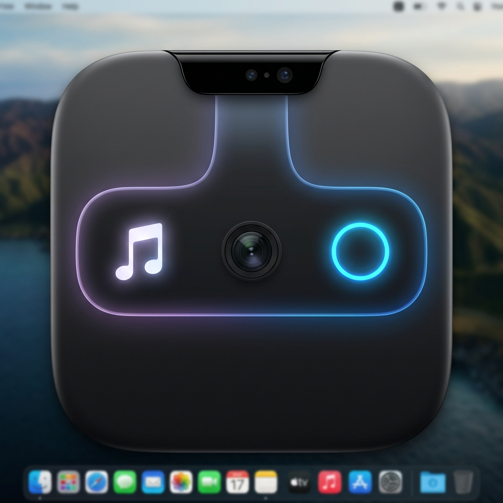

# NotchDrop

<p align="center">
  
</p>

A personal-use macOS notch overlay app for MacBook Air M4, inspired by [NotchDrop](https://lo.cafe/notchnook). Built with Swift + SwiftUI + AppKit.


## Features

### Widgets
- 🔋 **Battery Status** - Percentage, charging state, time remaining
- 🎵 **Music Player** - Now playing with controls (Apple Music/Spotify)
- 📅 **Calendar Events** - Upcoming events from your calendars
- 💻 **System Monitor** - CPU and RAM usage with progress bars
- 🕐 **Date & Time** - Current time and date display
- 📶 **Network Status** - Wi-Fi/Ethernet status and signal strength

### System Controls
- 📶 Wi-Fi Toggle
- 📲 Bluetooth Toggle
- 🌙 Do Not Disturb Toggle
- 📡 AirDrop Toggle
- 🌓 Dark Mode Toggle

### Menu Bar
- Left-click: Toggle notch panel
- Right-click: Access settings, launch at login, quit

## Requirements

- **macOS 14.0 (Sonoma)** or later
- **MacBook with notch** (MacBook Pro 14"/16" 2021+, MacBook Air M2/M3/M4)
- **Xcode 15.0** or later

## Installation & Setup

### Step 1: Open in Xcode

```bash
cd /path/to/NotchDrop
open NotchDrop.xcodeproj
```

### Step 2: Configure Signing

1. Select the **NotchDrop** target
2. Go to **Signing & Capabilities**
3. Select your **Team** (Personal Team is fine for personal use)
4. Xcode will auto-generate signing certificates

### Step 3: Build & Run

Press **⌘R** to build and run the app.

### Step 4: Grant Permissions

On first launch, you'll be prompted to grant:

1. **Accessibility Access** (System Settings → Privacy & Security → Accessibility)
2. **Calendar Access** (for calendar widget)
3. **Automation Access** (for system controls like Dark Mode)

## How It Works

### Notch Positioning

The app creates a transparent, borderless `NSPanel` positioned directly under the MacBook notch:

```swift
// Center horizontally, position at top of screen
let x = screenFrame.midX - (width / 2)
let y = screenFrame.maxY - height - 5  // 5pt below top edge
```

### Hover Detection

The window uses `NSTrackingArea` to detect mouse enter/exit events and smoothly expand/collapse using SwiftUI animations.

### Window Configuration

```swift
// Key window properties for notch overlay
level = .statusBar + 1          // Float above everything
collectionBehavior = [
    .canJoinAllSpaces,           // Show on all spaces
    .stationary,                  // Don't move with space changes
    .ignoresCycle,                // Don't include in ⌘Tab
    .fullScreenAuxiliary          // Show over full screen apps
]
styleMask = [.borderless, .nonactivatingPanel]
```

## Project Structure

```
NotchDrop/
├── App/
│   ├── NotchDropApp.swift       # SwiftUI app entry
│   ├── AppDelegate.swift        # AppKit delegate
│   └── Constants.swift          # App constants
├── Window/
│   ├── NotchPanel.swift         # Custom NSPanel
│   ├── NotchWindowController.swift
│   └── NotchWindowManager.swift
├── Views/
│   ├── NotchContentView.swift   # Main content
│   └── ExpandedNotchView.swift  # Expanded state
├── Widgets/
│   ├── BatteryWidget.swift
│   ├── MusicPlayerWidget.swift
│   ├── CalendarWidget.swift
│   ├── SystemMonitorWidget.swift
│   ├── DateTimeWidget.swift
│   └── NetworkWidget.swift
├── Controls/
│   ├── ControlsGridView.swift
│   ├── WiFiToggle.swift
│   ├── BluetoothToggle.swift
│   ├── DNDToggle.swift
│   ├── AirDropToggle.swift
│   └── DarkModeToggle.swift
├── Services/
│   ├── BatteryMonitor.swift
│   ├── SystemMonitor.swift
│   ├── NetworkManager.swift
│   ├── MediaController.swift
│   └── CalendarService.swift
├── MenuBar/
│   └── MenuBarManager.swift
├── Settings/
│   ├── SettingsManager.swift
│   └── SettingsView.swift
├── Utilities/
│   ├── Animations.swift
│   ├── BlurView.swift
│   └── Extensions.swift
└── Resources/
    ├── Assets.xcassets
    ├── Info.plist
    └── NotchDrop.entitlements
```

## Entitlements & Permissions

The app requires these entitlements (configured in `NotchDrop.entitlements`):

| Entitlement | Purpose |
|-------------|---------|
| `com.apple.security.app-sandbox = false` | Access system APIs |
| `com.apple.security.automation.apple-events` | Control Dark Mode, DND |
| `com.apple.security.personal-information.calendars` | Read calendar events |

## Keyboard Shortcuts

| Shortcut | Action |
|----------|--------|
| ⌘⌥N | Toggle notch panel |
| ⌘, | Open settings |

## Debugging Tips

### Panel Not Appearing?
1. Check that the app is running (menu bar icon should be visible)
2. Verify the Mac has a notch (won't position correctly on non-notch Macs)
3. Check Console.app for any crash logs

### Widgets Not Updating?
1. Grant required permissions in System Settings
2. Check that services are being initialized in `AppDelegate`

### Music Widget Empty?
1. Start playing music in Apple Music or Spotify
2. The MediaRemote framework requires audio to be playing

## Known Limitations

- **MediaRemote is a private API** - May break with macOS updates
- **No App Store submission** - Uses private APIs and disabled sandbox
- **Notch Macs only** - Designed for MacBook Pro/Air with notch

## License

This project is for **personal use only**. Not intended for redistribution or App Store submission.

## Credits

Inspired by [NotchNook](https://lo.cafe/notchnook) by Lo.Cafe.
